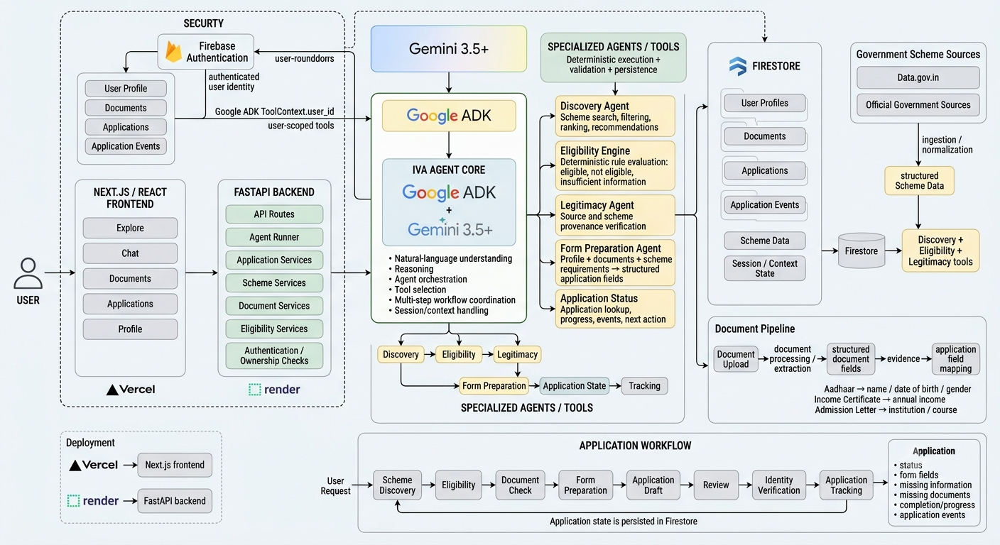

# IVA

> IVA turns government-scheme discovery into action — finding what you qualify for, preparing your application, and tracking what comes next.

IVA is an agentic assistant for government scholarships and welfare schemes. Instead of stopping at scheme discovery, IVA coordinates a multi-step workflow that can discover relevant schemes, evaluate eligibility, use profile and document evidence, prepare application fields, identify missing requirements, and track application state.

## Why IVA?

Finding a government scheme is often easier than completing the process.

Users may need to navigate multiple portals, interpret eligibility rules, collect documents, repeatedly enter the same information, and understand what is still missing after starting an application.

IVA focuses on that operational gap:

**Discover -> Evaluate -> Verify -> Prepare -> Review -> Track**

The goal is to turn a messy, multi-step administrative task into a workflow an agent can actively operate.

## What IVA Does

### Scheme Discovery

Users can describe their situation naturally and IVA can find relevant government schemes and scholarships from structured scheme data.

### Eligibility

IVA evaluates scheme requirements using deterministic rules and distinguishes between:

- Eligible
- Not Eligible
- Insufficient Information

Results can include matched rules, failed rules, and missing information.

### Document-Aware Preparation

IVA uses the user's profile and available documents to prepare application fields. Document-derived values can retain source and verification metadata so users can understand where an application value came from.

### Application Preparation

The agent coordinates the preparation workflow, creating and maintaining a structured application with:

- populated fields
- missing fields
- required documents
- completion and progress
- application status
- next action

### Application Tracking

Users can ask IVA for an application's progress without manually supplying internal application IDs. IVA resolves the authenticated user's application and retrieves its current state.

### Controlled Identity and Trust

User identity is obtained from the authenticated application and ADK context rather than being generated by the language model. User-scoped profile, document, and application operations are enforced by the backend.

## Agentic Architecture

IVA uses Gemini 3.6 Flash as its primary reasoning model and Google ADK for agent orchestration.



The central agent coordinates specialized capabilities for:

- Discovery
- Eligibility
- Legitimacy and source verification
- Form preparation
- Application status

The model handles interpretation, reasoning, orchestration, and explanation.

Deterministic backend services handle structured operations such as:

- identity
- eligibility rules
- document matching
- field mapping
- persistence
- application state
- status resolution

## Technology Stack

### Google and AI

- Gemini 3.6 Flash
- Google ADK (Agent Development Kit)
- Firestore
- Firebase Authentication

### Backend

- Python
- FastAPI

### Frontend

- Next.js
- React
- JavaScript

### Data Sources

- Government scheme data
- Data.gov.in
- Official government sources where applicable

### Deployment

- Vercel for the Next.js frontend
- Render for the FastAPI backend

## Core Workflow

```text
User request
     |
     v
IVA Agent
     |
     v
Scheme Discovery
     |
     v
Eligibility Evaluation
     |
     v
Profile + Document Evidence
     |
     v
Form Preparation
     |
     v
Missing Requirements
     |
     v
Application Draft
     |
     v
Review and Identity Handoff
     |
     v
Application Tracking
```

## Data and Trust Model

IVA keeps reasoning separate from trusted application state.

```text
Authenticated identity
        |
        v
User-scoped profile
        |
        v
Documents and evidence
        |
        v
Eligibility rules
        |
        v
Application field mapping
        |
        v
Persistent application state
```

For supported fields, verified document evidence can take precedence over unverified profile data. Conflicts are surfaced instead of silently overwritten.

Sensitive steps such as OTP, identity verification, CAPTCHA, and final government submission remain under user control.

## Demo Scenarios

The organizer demo account can demonstrate two controlled states.

### Fully Verified

A complete set of relevant demo documents is available so IVA can demonstrate a high-readiness application workflow.

### Needs Documents

A deliberately incomplete document set is used so IVA can identify missing requirements and demonstrate how the workflow changes when evidence is unavailable.

Scenario state is scoped to the authenticated demo account and scenario-managed documents are kept separate from user-uploaded documents.

## Project Structure

```text
IVA/
|
+-- backend/
|   +-- agents/                 # IVA agent graph, tools and orchestration
|   +-- app/
|   |   +-- routes/             # FastAPI API routes
|   |   +-- services/           # Scheme, document, application and data services
|   |   +-- models/             # Pydantic and domain models
|   +-- tests/                  # Backend and integration tests
|   +-- requirements.txt
|   +-- ...
|
+-- frontend/
|   +-- app/
|   |   +-- (dashboard)/        # Explore, Chat, Documents, Applications, Profile
|   |   +-- api/                # Next.js API proxy routes
|   +-- public/
|   |   +-- diagram.png         # Architecture diagram
|   +-- package.json
|   +-- ...
|
+-- README.md
```

## Local Setup

### Prerequisites

- Python 3.13 or newer
- Node.js 18 or newer
- npm
- Firebase project
- Gemini API access

### 1. Clone the repository

```bash
git clone <REPOSITORY_URL>
cd IVA
```

### 2. Backend Setup

```bash
cd backend

python -m venv .venv

.\.venv\Scripts\Activate.ps1

python -m pip install --upgrade pip

pip install -r requirements.txt
```

Create:

```
backend/.env
```

Add the required environment variables for the project, including Gemini and Firebase or Firestore configuration.

> Do not commit `.env` or private credentials to the repository.

Start the backend:

```bash
uvicorn app.main:app --reload
```

The backend should be available at:

```
http://127.0.0.1:8000
```

### 3. Frontend Setup

Open a second terminal:

```bash
cd frontend

npm install

npm run dev
```

The frontend should be available at:

```
http://localhost:3000
```

### 4. Run IVA

Open:

```
http://localhost:3000
```

Sign in through Firebase Authentication and open the dashboard.

## Reproducible Testing

### Backend tests

From the `backend` directory:

```bash
.\.venv\Scripts\Activate.ps1

python -m pytest tests -v
```

A successful run should report all available tests as passing.

### Frontend production build

From the `frontend` directory:

```bash
npm run build
```

A successful build confirms that the production Next.js application compiles without errors.

## Recommended End-to-End Verification

1. Sign in
2. Open Explore
3. Ask IVA about relevant schemes
4. Check eligibility
5. Open Documents
6. Review available evidence
7. Prepare an application
8. Open Form Fields
9. Verify populated values, sources and missing requirements
10. Check application progress and status

For authorized judging, the demo account can also be used to demonstrate the two controlled document scenarios.

## How AI Is Used

Gemini is not used as a generic text generator wrapped in a dashboard.

IVA uses Gemini through Google ADK as the reasoning and orchestration layer. The agent interprets the user's request and coordinates specialized tools and services.

Deterministic components remain responsible for operations that should not depend on model memory, including:

- authenticated user identity
- eligibility rule evaluation
- document ownership
- document matching
- application identifiers
- application persistence
- application status
- structured form mapping

This separation allows the agent to reason and act while keeping critical state and validation inside the application.

## Development and Iteration

AI-assisted development was used for:

- scaffolding
- debugging
- test generation
- data-pipeline development
- iteration on Firestore integration

Development was iterative: features were implemented, exercised through automated tests and end-to-end checks, and refined when integration problems surfaced.

Important engineering iterations included:

- moving authenticated identity into ADK ToolContext
- introducing three-way eligibility results
- adding source and verification metadata to prepared fields
- separating scheme IDs from application IDs
- implementing model failover for quota-related failures
- isolating user data from demo scenario data

## Challenges We Solved

### Identity Propagation

The model initially had access to a user ID parameter but no trusted mechanism for receiving it. This could lead to an invented identifier being passed to tools.

The architecture was changed so authenticated identity is supplied by the application runtime and injected into tools through ADK context.

### Eligibility Ambiguity

A binary eligibility result was insufficient because a user can be neither clearly eligible nor ineligible when required information is missing.

IVA therefore uses:

- Eligible
- Not Eligible
- Insufficient Information

### Document Trust

A profile value and a document-backed value should not automatically have the same trust level.

IVA therefore tracks document provenance and verification state so application fields can distinguish between profile-sourced and document-sourced information.

### Application State

The application needs more than a chat response.

IVA persists application data so users can inspect:

- progress
- fields
- documents
- missing requirements
- status
- next actions

### Model Reliability

Gemini provider quota failures introduced a real operational reliability problem during development.

IVA includes a configurable Gemini fallback chain so retryable model failures can move to another configured model while preserving the same logical request and session.

## Current Limitations

IVA intentionally keeps sensitive government actions under user control.

The current prototype does not claim direct access to every government portal or every government verification service. Where those integrations are unavailable, controlled demonstration paths are used while preserving the distinction between application preparation and final identity-verified submission.

## Hackathon Requirements

IVA uses the required Google technologies:

- Gemini 3.5 or newer
- Google ADK
- Firestore

The primary reasoning model is Gemini 3.6 Flash.

Firebase Authentication is used for authenticated user identity and Firestore is used for persistent application and document state.

The final web application is deployed using Vercel for the Next.js frontend and Render for the FastAPI backend.