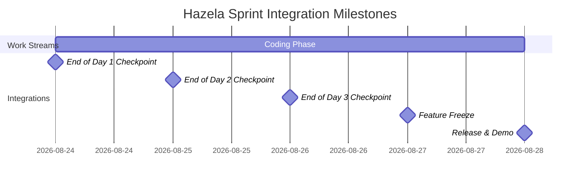

# Hazela Shared Skeleton

Hazela is an agent-integrated automation sprint project designed to handle user profile flows, application tracking, voice/IVR webhooks, and background status job runners. This skeleton serves as the shared foundation for a 4-person, 5-day parallel sprint.

---

## 🚀 How to Run Locally

### Prerequisites
- Python 3.10+
- Node.js 18+
- Docker (optional)

### 1. Running the Backend (FastAPI)
1. Navigate to the project root:
   ```bash
   cd project
   ```
2. Create and activate a Python virtual environment:
   ```bash
   python -m venv .venv
   # Windows:
   .venv\Scripts\activate
   # macOS/Linux:
   source .venv/bin/activate
   ```
3. Install the dependencies:
   ```bash
   pip install -r requirements.txt
   ```
4. Copy the environment template:
   ```bash
   copy .env.example .env
   ```
5. Run the FastAPI development server:
   ```bash
   npm run dev:backend
   ```
   *Alternatively, run: `uvicorn backend.app.main:app --reload --port 8000`*

Verify that the health check works by visiting [http://localhost:8000/health](http://localhost:8000/health) or running:
```bash
curl http://localhost:8000/health
```

### 2. Running the Frontend (React + Vite)
1. Install node dependencies:
   ```bash
   npm install
   ```
2. Start the interactive React development server:
   ```bash
   npm run dev:frontend
   ```
3. Open [http://localhost:5173](http://localhost:5173) in your browser.

### 3. Running with Docker
1. Build the Docker image:
   ```bash
   docker build -t hazela-backend .
   ```
2. Run the container:
   ```bash
   docker run -p 8000:8000 hazela-backend
   ```

---

## 🌿 Git Branch & Directory Ownership

To prevent merge conflicts and ensure clean integration, each of the 4 developers owns a specific set of folders. **No developer should write code in paths outside their owned lanes.**

| Branch Name | Owner Role | Paths Owned | Key Responsibilities |
| :--- | :--- | :--- | :--- |
| `feature/agent-core` | Lead AI Engineer | `backend/agents/`<br>`backend/services/agent/` | Agent execution loops, prompt templates, and AI tools. |
| `feature/frontend-user-flow` | Frontend Specialist | `frontend/`<br>`backend/routes/user/`<br>`backend/routes/applications/` | React app pages, user registration routes, app submission routes. |
| `feature/voice-ivr` | Voice Systems Dev | `backend/routes/voice/`<br>`backend/services/voice/` | Inbound call routes, Twilio TwiML builders, out-dial triggers. |
| `feature/status-documents` | Integration Engineer | `backend/services/documents/`<br>`backend/services/status/`<br>`backend/jobs/`<br>`backend/tests/integration/` | File processing, state machine transitions, cron tasks, integration tests. |

---

## ⚠️ The Strict Shared-File Rule

> [!IMPORTANT]
> **No feature branch should independently rewrite, add packages to, or modify the following files:**
> - `project/backend/app/main.py`
> - `project/requirements.txt`
> - `project/package.json`
> - `project/docs/architecture.md`
>
> **Single Scaffolding Owner Assigned:** **Lead Integration Engineer**
> If you need to install a library, add an API endpoint route registration, or modify database models, you must request it through the Scaffolding Owner. Changes will be merged to `main` via a tiny, fast-reviewed PR, and everyone must immediately pull the update.

---

## 📅 Sprint Merge Cadence

Integrate early and often. Below is the 5-day schedule for the sprint.



### Git Integration Routine:
At the integration checkpoints (end of Day 1, 2, and 3):
1. **Push:** Push current feature branch work to origin.
2. **Pull Main:** Pull latest `main` into your local branch:
   ```bash
   git checkout main
   git pull origin main
   git checkout feature/your-branch-name
   git merge main
   ```
3. **Resolve:** Resolve conflict/verify tests locally.
4. **Pull Request:** Create a Pull Request (PR) to merge your branch to `main`.
5. **Sync:** Once merged, all other developers checkout `main`, pull the updates, and merge them into their branches.
